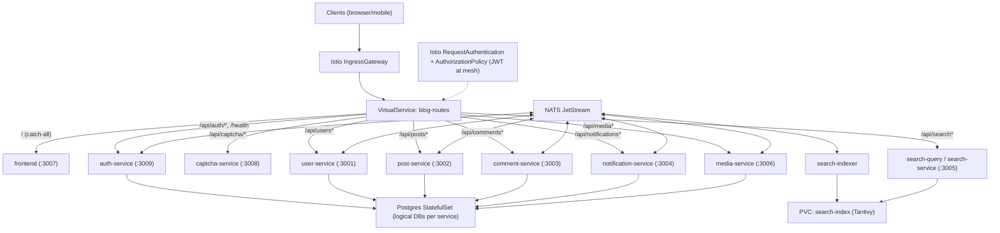

# Microservice Blog Platform

A full-stack blog platform built as a distributed microservice architecture — 3 Rust services, 5 TypeScript services, a React SPA frontend, and Kubernetes-native deployment with Istio service mesh, HashiCorp Vault secrets management, and NKey-authenticated NATS messaging.

## Architecture



## Services

| Service | Language | Port | Database | Description |
|---------|----------|------|----------|-------------|
| **gateway** | Rust (Axum) | 3000 | — | API gateway: JWT auth, rate limiting, CORS, reverse proxy |
| **user** | TypeScript (Fastify) | 3001 | `blog_users` | Registration, login, profiles, role management |
| **post** | TypeScript (Fastify) | 3002 | `blog_posts` | Post CRUD, slugs, drafts/publishing, media attachments |
| **comment** | TypeScript (Fastify) | 3003 | `blog_comments` | Comment CRUD on posts |
| **notification** | TypeScript (Fastify) | 3004 | `blog_notifications` | Notification inbox, driven by NATS events |
| **search** | Rust (Axum) | 3005 | Tantivy (on-disk) | Full-text search: runs as indexer + query pair |
| **media** | Rust (Axum) | 3006 | `blog_media` | File upload, image processing, serving |
| **captcha** | TypeScript (Fastify) | 3008 | — | Self-hosted SVG text captcha for registration |
| **frontend** | React 19 + Vite | 3007 | — | SPA with Fastify static server for production |

## Tech Stack

**Backend (Rust):** Axum, Tokio, SQLx, async-nats, Tantivy, jsonwebtoken, reqwest, tower-http

**Backend (TypeScript):** Fastify, Drizzle ORM, PostgreSQL (via postgres.js), NATS (nats.js), Zod

**Frontend:** React 19, React Router 7, React Query 5, StyleX, Vite, Marked + DOMPurify

**Infrastructure:** PostgreSQL 16, NATS 2.10 (JetStream), Docker (BuildKit), Kubernetes, Skaffold, Kind

**Service Mesh:** Istio (mTLS, AuthorizationPolicies, Gateway/VirtualService, DestinationRules)

**Secrets:** HashiCorp Vault + Vault Secrets Operator (dynamic DB creds, KV secrets, Kubernetes auth)

**NATS Security:** Ed25519 NKey authentication with per-service publish/subscribe permissions

## Gateway Routing

All external API requests go through the gateway at `/api/*`:

| Route Prefix | Backend Service |
|---|---|
| `/api/auth/*`, `/api/users/*` | user-service:3001 |
| `/api/posts/*` | post-service:3002 |
| `/api/comments/*` | comment-service:3003 |
| `/api/notifications/*` | notification-service:3004 |
| `/api/search/*` | search-service:3005 |
| `/api/media/*` | media-service:3006 |
| `/api/captcha/*` | captcha-service:3008 |

The gateway validates JWTs on all routes except `POST /api/auth/register` and `POST /api/auth/login`. Authenticated requests get `X-User-Id`, `X-User-Role`, and `X-Username` headers injected before forwarding.

## Event Bus

Services communicate asynchronously via NATS JetStream on stream `BLOG_EVENTS` with subject pattern `blog.>`. Each service authenticates with an Ed25519 NKey and is restricted to its own publish/subscribe permissions:

| Subject | Published By | Consumed By |
|---|---|---|
| `blog.user.created` | user | notification |
| `blog.user.updated` | user | — |
| `blog.user.deleted` | user | post, comment, notification, media |
| `blog.post.created` | post | search, notification |
| `blog.post.updated` | post | search |
| `blog.post.published` | post | search, notification |
| `blog.post.deleted` | post | search, comment, notification |
| `blog.comment.created` | comment | notification |
| `blog.comment.deleted` | comment | — |
| `blog.media.uploaded` | media | — |
| `blog.media.deleted` | media | — |

Each consumer is durable and named after its service (e.g., `search-service`). NKey seeds are stored in Vault and injected via VSO as Kubernetes Secrets.

## Getting Started

### Prerequisites

- Docker with BuildKit (Docker 23+)
- Node.js 22+
- Rust 1.92+ (for local dev)
- Kind + kubectl + Skaffold (for K8s deployment)
- Helm 3 (for Vault + VSO installation)

### Quick Start (Docker Compose)

```bash
cp .env.example .env          # Configure secrets
docker compose up --build     # Build and start everything
```

The frontend will be available at `http://localhost:3007` and the API at `http://localhost:3000`. Docker Compose mode does not use Istio, Vault, or NATS NKey auth — secrets are read from `.env` and NATS runs without authentication.

### Local Development

```bash
# Infrastructure only
docker compose -f docker-compose.infra.yml up -d

# TypeScript services (each in a separate terminal)
npm install
npm run dev:user
npm run dev:post
npm run dev:comment
npm run dev:notification
npm run dev:captcha
npm run dev:frontend

# Rust services (each in a separate terminal)
cargo run -p blog-gateway
cargo run -p blog-search
cargo run -p blog-media
```

### Kubernetes (Kind)

```bash
./scripts/kind-setup.sh       # Create cluster, build images, deploy everything
skaffold dev                  # Dev loop with hot reload
./scripts/kind-teardown.sh    # Tear down cluster
```

`kind-setup.sh` handles the full bootstrap:

1. Creates a Kind cluster (deletes existing one if present)
2. Builds and loads all Docker images
3. Installs Istio service mesh (minimal profile, NodePort ingress)
4. Installs Vault (dev mode) and Vault Secrets Operator via Helm
5. Seeds Vault with secrets (JWT, admin, postgres password) and configures Kubernetes auth
6. Generates NATS NKey pairs (seeds in Vault, public keys in NATS config)
7. Deploys the blog platform via Kustomize
8. Configures Vault database engine with per-service dynamic credentials

Kind deployments use the `:dev` image tag. When manually building and loading images:

```bash
docker build --network=host -t blog/frontend:dev -f services/frontend/Dockerfile .
kind load docker-image blog/frontend:dev --name blog
kubectl rollout restart deployment/frontend -n blog
```

## Project Structure

```
.
├── crates/                     # Rust workspace
│   ├── gateway/                #   API gateway (Axum)
│   ├── search/                 #   Full-text search (Tantivy)
│   ├── media/                  #   Media service (image upload/serve)
│   └── shared/                 #   Shared Rust types and NATS subjects
├── services/                   # TypeScript workspace (npm workspaces)
│   ├── user/                   #   User/auth service (Fastify)
│   ├── post/                   #   Post service (Fastify)
│   ├── comment/                #   Comment service (Fastify)
│   ├── notification/           #   Notification service (Fastify)
│   ├── captcha/                #   Captcha service (Fastify)
│   ├── frontend/               #   React SPA + Fastify static server
│   └── shared/                 #   Shared TS types, NATS subjects, DB helpers
├── k8s/
│   ├── base/                   #   Base Kustomize manifests
│   │   ├── istio/              #     Istio Gateway, VirtualService, AuthPolicies, etc.
│   │   ├── vault/              #     VSO CRDs (VaultAuth, Static/DynamicSecrets)
│   │   │   └── policies/       #       Per-service Vault HCL policies
│   │   ├── nats/               #     NATS deployment with NKey auth config
│   │   ├── postgres/           #     PostgreSQL StatefulSet + init scripts
│   │   └── <service>/          #     Per-service deployments
│   └── overlays/
│       ├── dev/                #   Dev overlay (debug logging)
│       └── production/         #   Production overlay (STRICT mTLS, HTTPS, NATS TLS)
├── scripts/
│   ├── kind-setup.sh           #   Kind cluster full bootstrap
│   ├── kind-teardown.sh        #   Kind cluster teardown
│   ├── install-istio.sh        #   Install Istio via istioctl
│   ├── install-vault.sh        #   Install Vault + VSO via Helm
│   ├── configure-vault.sh      #   Seed Vault: KV secrets, auth, DB engine
│   ├── generate-nats-nkeys.sh  #   Generate NKey pairs, store in Vault
│   ├── init-databases.sql      #   PostgreSQL init (creates DBs, for docker-compose)
│   └── migrate-all.sh          #   Run all DB migrations
├── Cargo.toml                  # Rust workspace root
├── package.json                # Node workspace root
├── docker-compose.yml          # Full stack (all services)
├── docker-compose.infra.yml    # Infrastructure only (PG + NATS)
├── skaffold.yaml               # Skaffold dev config
└── kind-cluster.yaml           # Kind cluster config
```

## Docker Builds

All Dockerfiles use BuildKit syntax with cache mounts for fast rebuilds:

- **Node services:** `--mount=type=cache,target=/root/.npm` caches npm downloads
- **Rust services:** Per-service cache IDs for cargo registry and target directory to avoid corruption during parallel builds
- **Host networking:** All builds use `network: host` (configured in `docker-compose.yml` and `skaffold.yaml`) for DNS resolution

## Environment Variables

| Variable | Used By | Description |
|---|---|---|
| `DATABASE_URL` | user, post, comment, notification, media | PostgreSQL connection string |
| `NATS_URL` | all except frontend, captcha | NATS server URL |
| `NATS_NKEY_SEED` | user, post, comment, notification, search, media | Ed25519 NKey seed for NATS auth |
| `JWT_SECRET` | gateway, user | HS256 JWT signing secret |
| `CAPTCHA_SECRET` | gateway, captcha | HMAC secret for captcha tokens |
| `CORS_ORIGINS` | gateway, user, captcha | Allowed CORS origins |
| `PORT` | all | Service listen port |
| `LOG_LEVEL` | all | Log level (`debug`, `info`, `warn`, `error`) |

In Kubernetes, `DATABASE_URL` is provided by Vault dynamic credentials (rotated hourly), `JWT_SECRET`/`CAPTCHA_SECRET` come from Vault KV, and `NATS_NKEY_SEED` comes from Vault KV — all synced to Kubernetes Secrets by the Vault Secrets Operator.

## Security

### Istio Service Mesh

All pods in the `blog` namespace run with an Istio Envoy sidecar. Traffic between services is encrypted with mutual TLS.

- **PeerAuthentication**: PERMISSIVE in dev (allows plaintext during migration), STRICT in production
- **AuthorizationPolicies**: Deny-by-default with explicit allow rules per service-to-service path (e.g., only the gateway ServiceAccount can reach backend services)
- **DestinationRules**: Connection pool limits (100 max connections) and outlier detection (eject after 5 consecutive 5xx errors)
- **Gateway + VirtualService**: Replaces NGINX Ingress for routing `/api/*` and `/*` traffic

### HashiCorp Vault

Secrets are managed by Vault and synced to Kubernetes via the Vault Secrets Operator (CRD-based, no sidecar injector).

- **Static secrets** (KV v2): `JWT_SECRET`, `CAPTCHA_SECRET`, admin credentials, postgres password
- **Dynamic secrets** (database engine): Per-service PostgreSQL credentials with 1h TTL and automatic rotation. Each service gets its own Vault database config connected to its specific database, so grants execute in the correct schema context.
- **NATS NKey seeds**: Stored in Vault KV, synced to per-service Kubernetes Secrets
- **Kubernetes auth**: Each service authenticates to Vault via its ServiceAccount, scoped to a least-privilege Vault policy

### NATS NKey Authentication

Each service connecting to NATS authenticates with an Ed25519 NKey pair. The NATS server config enforces per-service publish/subscribe permissions:

| Service | Can Publish | Can Subscribe |
|---|---|---|
| user-service | `blog.user.>` | JetStream only |
| post-service | `blog.post.>` | `blog.user.deleted` |
| comment-service | `blog.comment.>` | `blog.post.deleted`, `blog.user.deleted` |
| notification-service | — | `blog.comment.created`, `blog.post.published`, `blog.user.deleted` |
| search-indexer | — | `blog.post.>` |
| media-service | `blog.media.>` | `blog.user.deleted` |

NKey pairs are generated by `scripts/generate-nats-nkeys.sh` using the `nk` tool (via `natsio/nats-box` Docker image). Seeds are stored in Vault; public keys are written into the NATS server ConfigMap.

## CI

GitHub Actions runs on push/PR to `main`:

1. **Rust Check & Clippy** — `cargo check`, `cargo clippy`, `cargo fmt --check`
2. **TypeScript Check** — `npm install`, workspace typecheck
3. **Docker Build** — Builds all service images in a matrix
4. **K8s Validate** — Validates base, dev, and production Kustomize overlays
